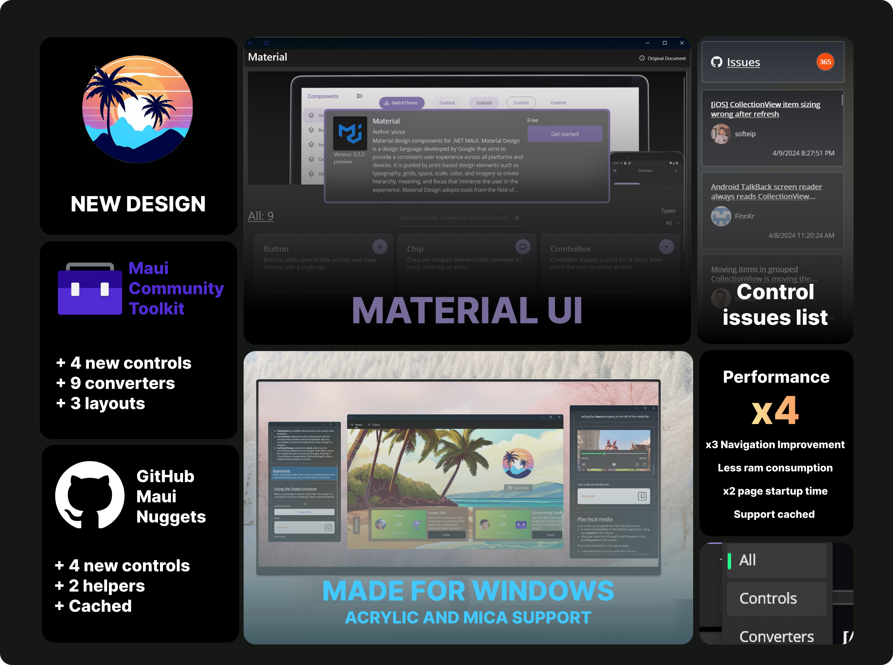
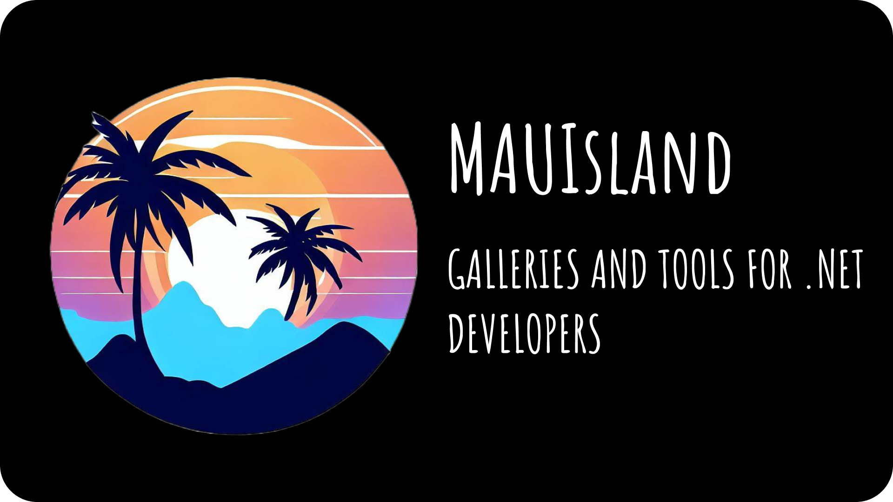

# 🏝️ MAUIsland



NET MAUI Control Gallery is an app that showcases all the .NET MAUI controls available for developers. It allows you to easily interact with them and see how they look and behave on different platforms. It also provides guidance, tips and tricks to help you use them effectively in your own apps. 

<p align="center">
  
</p>
<h1 align="center">
  MAUIsland
</h1>
<p align="center">
  Explore and interact. Stay up to date with the .NET MAUI Community.
</p>
<p align="center">
  <a href="https://www.microsoft.com/store/productId/9NLQ0J5P471L" target="_blank">
    
  </a>
</p>

# Version 2.0 (Dragon version)
1. Revamped Design 🎨: The application now features a sleek, acrylic material design. The interface is smoother, with enhanced contrast and reduced distractions, offering users a more engaging experience.

2. Performance Enhancements 🏎️: Significant improvements have been made in page navigation, resulting in a reduced memory footprint. Additionally, internet data is cached locally in a database, enhancing performance and enabling better offline support. The lazy loading of the code view expander contributes to faster initialization of pages.

3. Expanded Community Toolkit 🔨: The Community Toolkit Gallery has been enriched with the addition of four new controls, nine converters, and three layouts, empowering developers with more tools to enhance their applications.

4. GitHub Community Gallery 🤝: We've integrated six widely used GitHub nuggets that are commonly utilized with .NET MAUI, including LiveChart2, ZXing.Net.Maui, and more. This gallery not only provides access to these resources but also offers UI fixes to address issues like stretched clicking and hovering targets for a smoother user interaction.

# ⚠️ Create appsettings.Development.json before run App
1. Click right MAUIsland in Solution Explorer
2. Select Add -> New Item -> only JSON File
3. Set Name: appsettings.Development.json
4. Click Add and copy the format below (You can leave the key value empty if you don't have the syncfusion key, but this will lead to a crash if you try to view syncfusion controls)
Add the json settings from the issue:
```json
{
  "AppSettings": {
    "SyncfusionKey": "Your_syncfustion_key"
  }
}
```

# 🚀 Features

1. Browse through over 50 .NET MAUI controls organized by categories
2. See live previews of each control on iOS, Android, Windows, and Mac
3. Learn how to use each control with code snippets and documentation links
4. Customize each control’s properties and styles
5. Copy code snippets to the clipboard and use them in your app

# ⬇️ Installation
To install .NET MAUI Control Gallery on your device or emulator/simulator:

1. Clone or download this repository
2. Open the solution file (.sln) in Visual Studio 2022 or later
3. Select your target platform and device/emulator/simulator
4. Create the appsettings.Development.json file this file will not contain any private key
5. Build and run the app

We will publish our application on all platforms soon enough. Stay tuned!!!

# ⁉ Support

If you need help with something or have an idea, feel free to start a [Discussion](https://github.com/CommunityToolkit/WindowsCommunityToolkit/discussions) or find us on [Discord](https://discord.gg/edgzveQ9KN). If you have detailed repro steps, open an [issue here instead](https://github.com/Strypper/mauisland/issues/new/choose).

# 📄 Code of Conduct

This project has adopted the code of conduct defined by the [Contributor Covenant](http://contributor-covenant.org/)
to clarify expected behavior in our community.
For more information see the [.NET Foundation Code of Conduct](CODE_OF_CONDUCT.md).

# Meet the contributors
<a href="https://github.com/Strypper/MAUIsland/graphs/contributors">
  
</a>

Made with [contrib.rocks](https://contrib.rocks).
