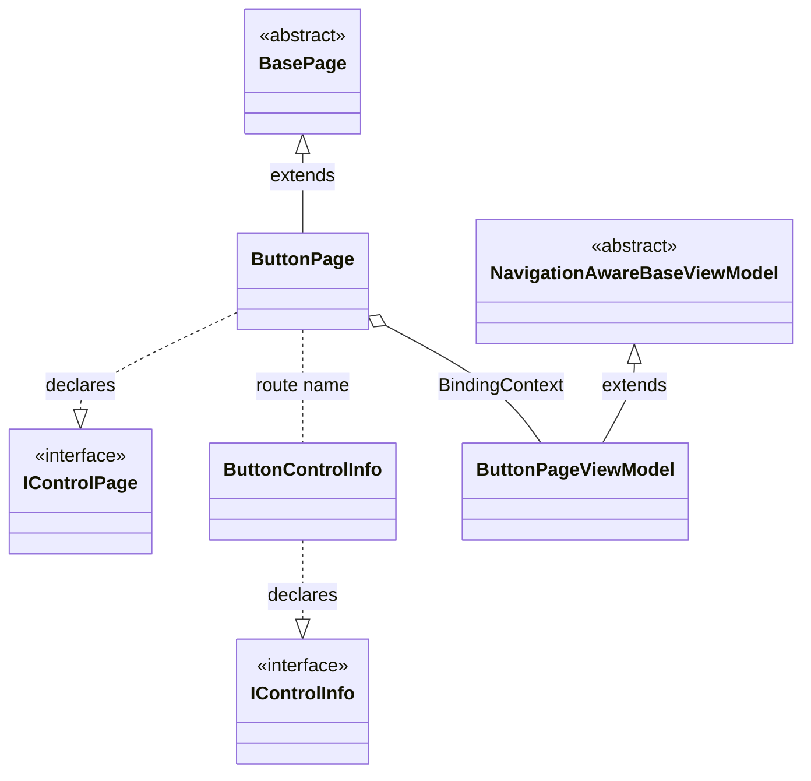

# Meet the contributors
<a href="https://github.com/Strypper/MAUIsland/graphs/contributors">
  
</a>

Made with [contrib.rocks](https://contrib.rocks).
# Development Guide
- Repo template: [Chick and Paddy MAUI template](https://github.com/tuyen-vuduc/chick-and-paddy-dotnet-maui)
- Coding guidelines: [Naxam coding guidelines and pactices](https://github.com/NAXAM/guidelines-n-practices)

# How to create demo page for a control

## The steps
- Create a folder under `Gallery/Pages/{control-group}`
  - folder name must be the control name
  - control group can be BuiltIn, Syncfusion, etc.
- Create
  - a ControlInfo class
  - a XAML page
  - a VM class

e.g A demo page for Button built-in control will have below structure
```
|
|--Features
    |--Gallery
        |--Pages
            |--Button
                |--ButtonControlInfo
                |--ButtonPage.xaml
                |--ButtonPage.xaml.cs
                |--ButtonPageViewModel.cs
```

class diagram


## Use script

```
dotnet cake --group DESIRE_GROUP --name CONTROL_NAME
```

### Available groups
- `BuiltIn` - [MAUI built-in controls](https://learn.microsoft.com/en-us/dotnet/maui/user-interface/controls/?view=net-maui-7.0)
- `Syncfusion` - [Syncfusion controls for MAUI](https://www.syncfusion.com/maui-controls)

NOTE: We can add any new group we want.
